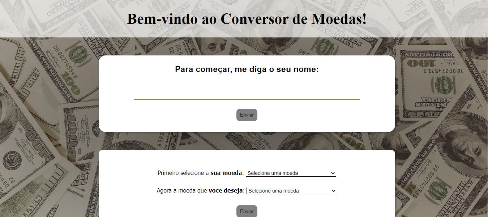

<h1>Currency Converter</h1>

This project was maded for Alura's Challenge, 5 days coding JavaScript.

 
<h2>Currency Converter</h2>

 

<h2>📚Tecnologies:</h2>

<ul>
    <li>HTML</li>
    <li>CSS</li>
    <li>JavaScript</li>
    <li>Git and Github</li>
</ul>

<h2>💻Project:</h2>

This project is not finished. It was made to practice HTML, CSS and some JavaScript functions to enable buttons after a certain amount of characters. In the future, I will use a JavaScript API to perform the currency conversion calculation.

Its online preview is not yet available. It will be made available at the end of the conversion process.

 

Desenvolved by GGabi40 | Inspired by Alura.
